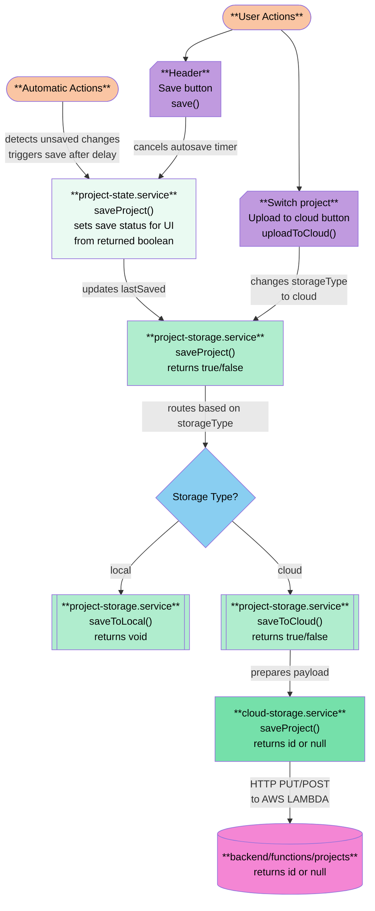

# AIDA (AI Design Assistant)

AIDA is an internal web application for Government of Canada departments to manage content design projects, identify problems, and create prototypes with the support of AI.

## Prerequisites

- **Node.js**: v22.22.0 (recommended to use [nvm](https://github.com/nvm-sh/nvm) for version management)
- **Angular CLI**: v19.2.14 ([Angular CLI](https://github.com/angular/angular-cli))
- **Git**: Latest version

## First-Time Setup

### 1. Install Node.js

If using nvm:
```bash
nvm install 22.22.0
nvm use 22.22.0
```

### 2. Install Angular CLI
```bash
npm install -g @angular/cli@19.2.14
```

### 3. Fork and Clone the Repository

1. Fork this repository to your personal GitHub account
2. Clone your fork:
```bash
git clone https://github.com/YOUR-USERNAME/ai-design-assistant.git
cd ai-design-assistant
```
3. Add the upstream remote:
```bash
git remote add upstream https://github.com/proto-cra/ai-design-assistant.git
```

### 4. Install Dependencies
```bash
npm install
```

### 5. Environment Configuration

The application uses environment files located in `src/environments/`
- `environment.development.ts` - local development, sandbox, and dev branches
- `environment.ts` - production

These files contain Lambda function URLs and are already configured. No additional setup required unless you are setting up your own AWS environment.

## Development Workflow

### Branch Strategy

- **Personal forks**: Do all development work in your fork, branching from `dev`
- **feature/*** branches: All development happens in feature branches
- **sandbox**: Testing ground for features requiring authentication (deploys to AWS dev)
- **dev**: Staging for the next release (deploys to AWS dev)
- **main**: Production branch (deploys to AWS production) - **Amber merges only**

**Important**: `sandbox` is a space for testing and experimentation. PRs should go from `feature/*` branches directly to `dev`, never from `sandbox` to `dev`.

### Development Process

1. **Keep your fork up to date:**
```bash
git checkout dev
git pull upstream dev
```

2. **Create a feature branch:**
```bash
git checkout -b feature/your-feature-name
```

3. **Develop and test locally:**
```bash
ng serve
```
Once the server is running, open your browser and navigate to `http://localhost:4200/`. The application will automatically reload whenever you modify any of the source files.

4. **Push to your fork:**
```bash
git push origin feature/your-feature-name
```

5. **If your feature needs authentication testing:**
```bash
git checkout sandbox
git pull upstream sandbox
git merge feature/your-feature-name
git push origin sandbox
```
Then open a PR to merge your fork's `sandbox` into upstream `sandbox`. Once merged, test in the deployed AWS dev environment.

6. **When your feature is complete and tested:**
   - Run `npm run lint` to check for code quality issues
   - Open PR from `feature/your-feature-name` directly to `dev`
   - **Do NOT merge `sandbox` to `dev`**
   - After your feature merges to `dev`, you may want to rebase `sandbox` on `dev` to clean it up

### Why This Workflow?

This approach allows multiple incomplete features to coexist in `sandbox` for authentication testing without blocking each other. Only finished, tested features get merged to `dev`, so you never have to "pick apart" what's ready for release.

### Cleaning Up Sandbox

After features merge to `dev`, you can clean up `sandbox` by rebasing it:
```bash
git checkout sandbox
git pull upstream dev
git rebase dev
git push --force origin sandbox
```

## Deployment & Environments

All deployments are automated via GitHub Actions:

| Branch | Environment | Trigger | Purpose |
|--------|-------------|---------|---------|
| `sandbox` | AWS Dev | Push to `sandbox` | Testing features requiring authentication |
| `dev` | AWS Dev | Push to `dev` | Staging the next release |
| `main` | AWS Production | Push to `main` | Live application |

**Note**: `sandbox` and `dev` both deploy to the same AWS dev infrastructure. They can't be deployed simultaneously - whichever branch pushes last is what's currently deployed.

## Tech Stack

### Frontend
- **Angular**: v19.2.14
- **PrimeNG**: v19 (UI component library)
- **PrimeFlex**: v4 (CSS utility library)
- **ngx-translate**: Internationalization (English, French)
- **Additional libraries**: Document processing (mammoth, pdfjs), diff visualization, file handling

### Backend
- **Infrastructure**: Terraform
- **Compute**: AWS Lambda
- **API**: API Gateway
- **Authentication**: GitHub OAuth
- **Storage**: DynamoDB

### Architecture Highlights
- Multi-tenant architecture using URL parameters and localStorage
- GitHub OAuth and PAT integration for authentication
- Content inventory for Canada.ca pages
- Export functionality for GitHub repositories

## Project Structure

Understanding the folder organization will help you find what you need quickly:
```
src/
├── app/
│   ├── common/           # Shared resources (interfaces, utilities, theme presets)
│   ├── components/       # Reusable UI components
│   │   └── component-name/
│   │       ├── component files
│   │       └── component.service.ts (if component-specific)
│   ├── services/         # Shared services used by multiple components (similar services may be grouped by folder)
│   ├── template/         # App shell components (header, sidenav, footer)
│   ├── views/            # Route components (pages)
│   │   └── view-name/    # Each view composes multiple components
│   └── app.routes.ts         # Route definitions
└── public/               # Static assets
```

**Key conventions:**
- **common/**: Interfaces, utilities, theme presets, and type definitions
- **components/**: Individual UI pieces (headings, inputs, cards) - not directly routable
- **views/**: Page-level components mapped to routes - control layout and composition
- **services/**: Put services here if used by multiple components; keep in component folder if only used by one component
- **template/**: App navigation and shell structure

## Key Implementation Details

### Organization Configuration & Multi-Tenancy
- User's organization is set via `?org=DEPT_CODE` URL parameter on first visit
- Stored in localStorage for subsequent visits
- If no org parameter is set, projects save to a default org visible to all users
- File lists are pre-filtered by user's org - users only see their own org's files plus default org files
- GitHub organization will be configured similarly (planned feature)
- See `app.component.ts` for URL parameter implementation

### Authentication & Access Control
- GitHub OAuth for user authentication - no separate user management system needed
- Alternative personal access token (PAT) authentication method is provided when API gateway is blocked by local IT policies
- Most features work without authentication (discovery, content inventory, etc.)
- Authentication required for: saving to DynamoDB, exporting to GitHub, and collaborator management
- Project access controlled via `collaborators` field (GitHub usernames)
- Users must be listed as collaborators in DynamoDB to edit/save/delete existing projects
- For new projects, user must be listed as collaborator in local project to save to DynamoDB

### Data Model
- Projects use a TreeNode structure to maintain page hierarchy from Canada.ca
- Page-level data is merged into the `data` field of TreeNode objects
- Project-level data stored in ProjectMetadata interface
- See `src/app/services/project-state.service.ts` for state management
- See `src/app/common/data.model.ts` for data structure definitions

### Internationalization
- English and French supported via ngx-translate
- Language toggle updates all text and maintains state across sessions
- Translation files located in `public/i18n/`

### Save Flow Architecture


**Key Paths:**
- **Active Project Save** (Header button): User → project-state → project-storage → cloud-storage/local
- **Upload to Cloud** (Switch project view): User → project-storage → cloud-storage

---

**Note**: This section highlights key patterns. Detailed documentation will be added as features stabilize.

## Common Development Tasks

### Generate a new component
```bash
ng generate component components/component-name
```

### Generate a new service
```bash
ng generate service services/service-name
```

### Run linting
```bash
npm run lint
```
**Run this before opening a PR to `dev`** to catch any code style or quality issues.

### Check for available schematics
```bash
ng generate --help
```

## Translation Workflow

### NPM Scripts

- **`npm run i18n:extract`** - Extract and sort all translation keys
- **`npm run i18n:clean`** - Remove unused keys and sort everything

### During Active Development

When adding new features with translation keys:

1. Run extraction to add and sort all keys:
```bash
   npm run i18n:extract
```

2. Open `public/i18n/en.json` and `public/i18n/fr.json`

3. Search for `": ""` to find keys that need translation

4. Add translations and save

### Marking Dynamic Translation Keys

For dynamically generated translation keys (e.g., keys built from variables), use the `marker` function to ensure they aren't removed during cleanup:
```typescript
import { marker } from '@colsen1991/ngx-translate-extract-marker';

private markForTranslation() {
    marker('inventory.columnGroups.page');
    marker('inventory.columnGroups.oppPage');
    marker('inventory.columnGroups.github');
    marker('inventory.columnGroups.status');
}
```

**Important:** Always run `npm run i18n:extract` after adding translations to verify all keys are properly marked. If keys are missing, add the `marker()` function for those keys.

### Maintenance & Cleanup

To remove unused translation keys:
```bash
npm run i18n:clean
```

Review the changes to ensure no dynamically generated keys were accidentally removed (if they were, they need `marker()` added).

### Translation Key Conventions

- **`_.*`** - App-level constants (sorts to top)
- **`common.*`** - Reusable text across the app (yes, no, cancel, etc.)
- **`[feature]._*`** - Section dividers (for easy scanning)
- **`[feature]._nav*`** - Page titles to be used in navigation
- **`[feature]._title*`** - Page and section titles
- **`[feature].*`** - Feature-specific translations (e.g., `projects.*`, `inventory.*`)

### Avoid translate.instant()

translate.instant() does not update when a user toggles languages. Let the template handle translations where possible and make sure to test the toggle experience for any translations in your .ts file.

---

## VS Code Setup

Recommended extensions:
- Angular Language Service
- Prettier - Code formatter
- ESLint

## Troubleshooting

### Port already in use
If `ng serve` fails because port 4200 is in use:
```bash
ng serve --port 4201
```

### Node version issues
Ensure you're using Node v22.22.0:
```bash
node --version
```

### Environment file issues
Verify that `src/environments/environment.development.ts` exists and contains the correct Lambda URLs.

### Merge conflicts in sandbox
If `sandbox` has conflicts when trying to merge your feature:
1. Don't worry - `sandbox` is just a testing ground
2. You can force-push your feature to your fork's `sandbox` if needed
3. Coordinate with your team if multiple people are testing

## Setting Up Your Own AWS Environment

If you're deploying AIDA to your own AWS infrastructure (not using the existing dev/production environments):

### 1. Configure Frontend Environment Files

Update Lambda function URLs in:
- `src/environments/environment.ts` (production)
- `src/environments/environment.development.ts` (development)

### 2. Configure Terraform Variables

Update the following files in `/backend/terraform/`:
- `production.tfvars`:
  - `allowed_origins` - Your production frontend URL
  - `github_oauth_redirect_uri` - Your GitHub OAuth callback URL
- `dev.tfvars`:
  - `allowed_origins` - Your dev frontend URL
  - `github_oauth_redirect_uri` - Your GitHub OAuth callback URL

---

**Note**: Most developers won't need this section - it's only for setting up entirely new AWS environments.

## Questions or Issues?

Contact Amber or open an issue in this repository.